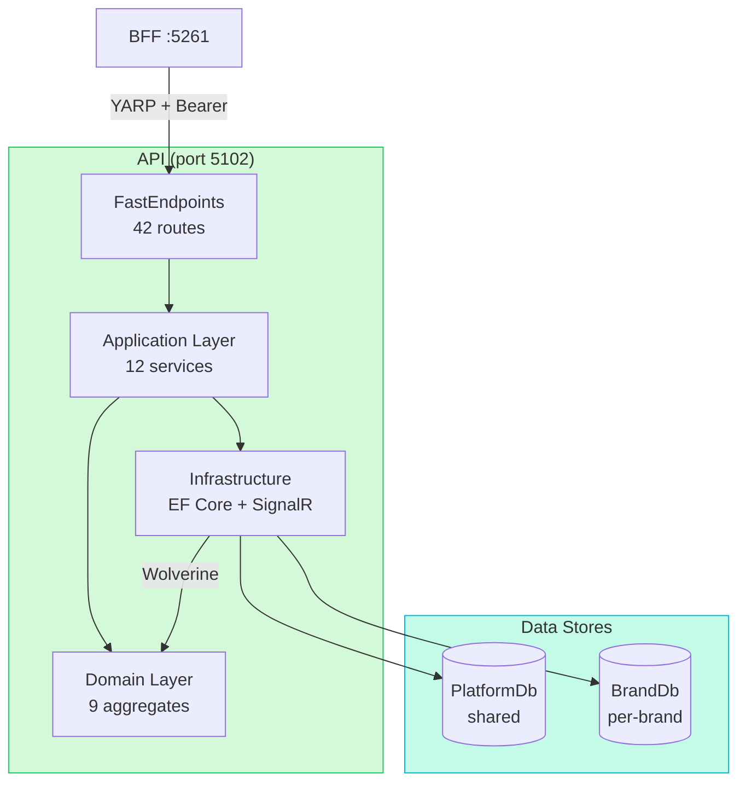
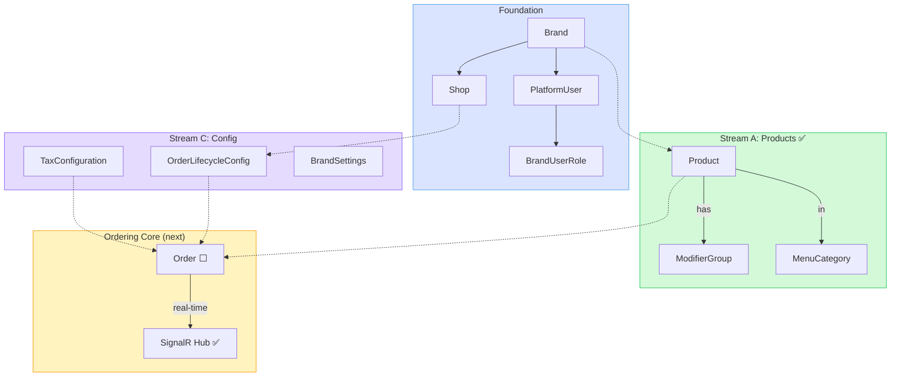

# Backend — CLAUDE.md

## Architecture Diagrams





## Tech Stack

- .NET (C#), ASP.NET Web API, .NET Aspire
- FastEndpoints (not controllers) with FluentValidation
- EF Core, database-per-brand (multi-tenant isolation)
- Swagger/OpenAPI via FastEndpoints
- Wolverine for async messaging and mediator (in-memory locally, RabbitMQ/Azure Service Bus in prod)

## Architecture

- BFF layer (.NET) between frontend and API — handles auth/session management
- Clean Architecture: Api → Application → Domain → Infrastructure
- DDD: aggregates, entities, value objects, domain events
- One endpoint per class — no controllers, no MediatR

## Solution Structure

```
TheMillionthFoodOrderApp.AppHost/            — .NET Aspire orchestrator (run this)
TheMillionthFoodOrderApp.Api/                — FastEndpoints API host (http://localhost:5102, Swagger at /swagger)
TheMillionthFoodOrderApp.Bff/                — Backend-for-frontend (auth/session, YARP proxy to API)
TheMillionthFoodOrderApp.Application/        — Use cases, services, DTOs
TheMillionthFoodOrderApp.Domain/             — DDD aggregates, entities, value objects, domain events
TheMillionthFoodOrderApp.Infrastructure/     — EF Core (PlatformDbContext, BrandDbContext), repositories, SignalR
TheMillionthFoodOrderApp.ServiceDefaults/    — Aspire shared config (telemetry, health)
TheMillionthFoodOrderApp.Tests.Unit/         — xUnit unit tests (Shouldly assertions)
TheMillionthFoodOrderApp.Tests.Integration/  — Integration tests (Testcontainers, real SQL Server)
```

## Local Development

- **Requires Docker Desktop** — Aspire runs SQL Server and Keycloak in containers with persistent volumes
- **SQL Server password** is set via `sql-password` Aspire parameter (prompted on first run). Required because `WithDataVolume` persists the password in the volume — random passwords desync on restart.
- **Keycloak** runs as Aspire container with realm auto-imported from `AppHost/keycloak/themillionfoodorderapp-realm.json`. Admin UI available at Aspire-assigned port. Persistent volume preserves data across restarts.
- API runs on `http://localhost:5102` — Swagger UI is the default launch page
- BFF runs on `http://localhost:5261` — auth endpoints + YARP proxy to API
- Frontend proxies `/api/*` and `/bff/*` to the BFF (not directly to API)
- Database: SQL Server container via Aspire, platform DB auto-migrated on startup. In dev, `BrandDatabaseProvisioner` is called explicitly at startup to create + migrate the brand DB before seeding (Wolverine isn't running yet at that point).
- Auth: mock auth enabled by default in dev (`Authentication:UseMockAuth=true`). Set to `false` to use Keycloak OIDC. Personas: `platform-admin`, `brand-admin@frietjes`, `counter-staff@frietjes`, `customer`. Test user passwords: `P@ssw0rd!`

## Aspire Integration (important — affects DI patterns)

This project uses **.NET Aspire** as the orchestrator. Aspire's `Add*` extension methods replace standard `AddDbContext`/`AddSqlServer` calls and bring **different defaults** than vanilla EF Core registration:

- **`builder.AddSqlServerDbContext<T>()`** registers the DbContext with **pooling enabled** by default.
- **Never use `OnConfiguring`** in pooled DbContexts — options are shared across pooled instances. Interceptors, query tracking, etc. must be configured via the `configureDbContextOptions` callback at registration time in `Program.cs`.
- **Connection strings are injected by Aspire** via the resource name (e.g., `"platform"`). Don't hardcode or read them from `appsettings.json`.
- **Service discovery** uses Aspire naming (e.g., `https+http://api` in YARP config). Don't use `localhost` URLs between services.
- **Health checks, retries, and telemetry** are wired automatically by Aspire — don't add them manually.

## Database Architecture

- **PlatformDbContext** — shared platform DB: brands, users (PlatformUser), roles (BrandUserRole), platform config. Registered via `AddSqlServerDbContext` (pooled).
- **BrandDbContext** — one DB per brand, created dynamically at runtime by `BrandDatabaseProvisioner`. Registered as **scoped** in DI via `BrandDbContextFactory` — inject directly into brand-scoped repositories.
- **BrandDbContextFactory** — resolves correct connection string based on brand slug (same SQL Server instance, different `Database=brand_{slug}`). Returns a placeholder context when no brand slug is set (happens at startup when FastEndpoints builds the route map).
- **BrandContextMiddleware** — validates brand slug from route/header against platform DB (cached 30s), returns 404/403 for invalid/inactive brands.
- **BrandScopedPreProcessor** — FastEndpoints pre-processor; add to all brand-scoped endpoints to guard against missing brand context.

## BFF Endpoints

- `GET /bff/login?mock=<persona>` — mock sign-in (dev) or OIDC challenge via Keycloak
- `POST /bff/logout` — sign out (cookie + federated OIDC logout when not using mock)
- `GET /bff/user` — current user info (always 200, returns `{ isAuthenticated: false }` if anonymous)
- `POST /bff/session/keepalive` — slide session expiration
- `/api/*` — YARP reverse proxy to API with bearer token forwarding (access token from OIDC stored via `SaveTokens=true`)

## Commands

- `dotnet run --project TheMillionthFoodOrderApp.AppHost` — start everything via Aspire
- `dotnet build TheMillionthFoodOrderApp.slnx` — build all projects
- `dotnet test` — run tests (xUnit)
- `dotnet ef migrations add <Name> --project TheMillionthFoodOrderApp.Infrastructure --startup-project TheMillionthFoodOrderApp.Api --context PlatformDbContext --output-dir Persistence/Migrations/Platform` — add platform migration
- `dotnet ef migrations add <Name> --project TheMillionthFoodOrderApp.Infrastructure --startup-project TheMillionthFoodOrderApp.Api --context BrandDbContext --output-dir Persistence/Migrations/Brand` — add brand migration

## Domain Bounded Contexts

```
Domain/
  Brands/              — Brand aggregate (name, slug, active status, StaffAuthMethod enum)
  Shops/               — Shop aggregate, Address value object, OpeningHoursTimeBlock, ShopCreatedEvent
  Products/            — Product aggregate (simple, modifier groups, combos), ProductTranslation, ComboItem
  ModifierGroups/      — ModifierGroup aggregate, Modifier, ProductModifierGroup, translations
  MenuCategories/      — MenuCategory aggregate, MenuCategoryTranslation
  BrandSettings/       — BrandSettings aggregate, BrandColors/BrandTypography value objects, PresetFonts
  Identity/            — PlatformUser aggregate, BrandUserRole entity, StaffRole enum
  OrderLifecycle/      — OrderLifecycleConfig aggregate, OrderStatus, OrderStatusTransition
  TaxConfiguration/    — TaxConfiguration aggregate, VatRate entity, TaxCalculator, TaxBreakdown value object
  Orders/              — OrderStatusChangedEvent (domain event for SignalR)
  Common/              — AggregateRoot, Entity, ValueObject base classes; Money VO; ConsumptionMode enum; IAuditable, ISoftDeletable interfaces
```

## Domain Aggregates & Marker Interfaces

| Aggregate | IAuditable | ISoftDeletable |
|-----------|:----------:|:--------------:|
| Brand | ✅ | — |
| Shop | ✅ | — |
| Product | ✅ | ✅ |
| ModifierGroup | ✅ | ✅ |
| MenuCategory | ✅ | ✅ |
| BrandSettings | ✅ | — |
| PlatformUser | ✅ | — |
| OrderLifecycleConfig | ✅ | — |
| TaxConfiguration | ✅ | — |

## Domain Enums

- `Allergen` — 14 EU allergens (Products)
- `DietaryTag` — dietary labels (Products)
- `ProductType` — simple / combo (Products)
- `StaffAuthMethod` — auth method per brand (Brands)
- `StaffRole` — brand-admin, counter-staff, etc. (Identity)
- `ConsumptionMode` — eat-in / takeaway (Common, used by VAT)
- `BrandValidationResult` — middleware validation outcomes (Application/Multitenancy)

## Application Layer Pattern

Each bounded context follows `IXxxService` (interface in Application) → `XxxService` (implementation in Application). `IFileStorageService` → `LocalFileStorageService` lives in Infrastructure.

## Infrastructure Conventions

- **EF entity configurations:** One `IEntityTypeConfiguration<T>` per entity (e.g. `BrandConfiguration`, `MenuCategoryConfiguration`)
- **AuditSaveChangesInterceptor** — auto-sets CreatedAt/UpdatedAt on entities implementing `IAuditable`
- **DateTimeOffsetConvention** — ensures all DateTimeOffset properties use `datetimeoffset(7)` SQL type
- **BrandDbSeeder** — seeds default data (e.g. Frietjes brand, sample products) in dev

## Domain Patterns

- **Soft-delete:** Implement `ISoftDeletable` (IsDeleted + DeletedAt). Add a global query filter on `BrandDbContext`: `HasQueryFilter(e => !e.IsDeleted)`. Use `IgnoreQueryFilters()` only when historical data is needed.
- **Translations:** Use a child entity (e.g. `ProductTranslation`) with composite unique index on `(ParentId, LanguageCode)`. Load eagerly with `Include()`. On update, clear the collection and re-add — avoids EF Core orphan tracking issues.
- **Money:** `Money` value object (Amount + Currency), mapped as EF owned entity with explicit column names (`BasePrice_Amount`, `BasePrice_Currency`).
- **Sort ordering:** Use an `int SortOrder` field. Reorder via a dedicated endpoint that accepts an ordered list of IDs and assigns 0..n-1 sequentially. Last-write-wins for MVP.
- **Domain events:** Wolverine handles domain events in-memory (e.g. `ShopCreatedEvent` triggers brand DB provisioning, `OrderStatusChangedEvent` triggers SignalR notifications).
- **Replacing child collections (backing-field pattern):** Domain aggregates expose children as `IReadOnlyCollection<T>` backed by a private `List<T>`. When a domain method calls `_field.Clear(); _field.AddRange(newItems)`, EF Core's snapshot-based change detection does **not** reliably detect the new items as Added — because the entity was loaded fresh without those items in its snapshot. This causes `DbUpdateConcurrencyException` ("expected 1 row, affected 0") on `SaveChanges`. The fix is a dedicated `ReplaceXxxAsync` repository method:
  1. `BeginTransactionAsync`
  2. `ExecuteDeleteAsync` children WHERE `parentId = id` (bypasses change tracker)
  3. `ChangeTracker.Clear()` (evicts stale tracked instances so `FirstAsync` returns a fresh object)
  4. `FirstAsync` parent without includes (no old snapshot)
  5. `mutate(parent)` — domain method now clears an empty collection and adds new items
  6. `DbSet.AddRangeAsync(parent.Children)` — **required**: explicitly registers new children; do not rely on navigation snapshot detection
  7. `SaveChangesAsync` + `CommitAsync`

  Existing examples: `OrderLifecycleConfigRepository.ReplaceAsync`, `TaxConfigurationRepository.ReplaceRatesAsync`, `ShopRepository.ReplaceOpeningHoursAsync`. Apply this pattern whenever a repository method must fully replace a child collection.

## Real-Time Notifications

- **SignalR** hub at `OrderHub` — pushes order status changes to connected clients
- `IOrderNotificationService` abstraction in Application, `SignalROrderNotificationService` in Infrastructure
- `OrderStatusChangedHandler` (Wolverine handler) bridges domain events to SignalR
- Frontend connects via `@microsoft/signalr` client (`useSignalR`, `useOrderUpdates` hooks)

## API Routes (42 endpoints)

All brand-scoped routes are prefixed with `/brands/{brandSlug}/` and guarded by `BrandScopedPreProcessor`.

| Resource | Routes |
|----------|--------|
| Brands | `GET/POST /brands`, `GET/PUT /brands/:id`, `POST .../activate`, `POST .../deactivate` |
| Staff Auth | `PUT /brands/:slug/staff-auth` |
| Shops | `GET/POST /brands/:slug/shops`, `GET/PUT /brands/:slug/shops/:id`, `POST .../activate`, `POST .../deactivate` |
| Opening Hours | `GET/PUT /brands/:slug/shops/:shopId/opening-hours`, `GET .../status` |
| Order Lifecycle | `GET/PUT /brands/:slug/shops/:shopId/order-lifecycle`, `POST .../reset` |
| Staff | `GET/POST /brands/:slug/staff`, `GET /brands/:slug/shops/:shopId/staff`, `POST .../staff/:roleId/deactivate` |
| Products | `GET/POST /brands/:slug/products`, `GET/PUT/DELETE /brands/:slug/products/:id` |
| Combos | `POST /brands/:slug/combo-products`, `PUT /brands/:slug/combo-products/:id` |
| Modifier Groups | `GET/POST /brands/:slug/modifier-groups`, `GET/PUT/DELETE .../modifier-groups/:id`, `GET /brands/:slug/products/:productId/modifier-groups` |
| Menu Categories | `GET/POST /brands/:slug/menu-categories`, `GET/PUT/DELETE .../menu-categories/:id`, `PUT .../sort-order`, `POST .../assign-product`, `GET .../menu-categories/:catId/products`, `PUT .../products/order` |
| Brand Settings | `GET/PUT /brands/:slug/settings`, `PUT .../settings/theming`, `POST .../settings/logo`, `GET /brands/:slug/theme` |
| Tax Config | `GET/PUT /brands/:slug/tax-configuration`, `POST .../calculate` |
| Platform Admins | `GET/POST /platform-admins`, `POST /platform-admins/:id/deactivate` |
| Orders (infra) | `POST /brands/:slug/orders/simulate-status-change` (dev-only) |

## Domain Constraints

- Belgian VAT: 6% takeaway, 21% eat-in
- Multi-language: NL, FR, DE

## Code Conventions

- **Always use `DateTimeOffset`** — never `DateTime`. DateTimeOffset is timezone-aware and avoids subtle bugs with UTC conversions and comparisons.
- **Always use `Guid.CreateVersion7()`** — never `Guid.NewGuid()`. UUIDv7 embeds a timestamp, producing time-ordered IDs that are better for database index performance and natural sort order.

## Testing

- **TUnit** for all tests (unit + integration) — `[Test]` attribute, `await Assert.That(x).IsEqualTo(y)` assertions
- Integration tests hit a real database (not mocks)
- **Testcontainers.MsSql** for integration tests — spins up SQL Server in Docker automatically
- `IntegrationTestWebAppFactory` replaces Aspire's pooled PlatformDbContext with a standard registration pointing at the test container
- `IntegrationTestBase` provisions multiple brand databases (alpha, beta, gamma) on the same container to verify cross-brand isolation; implements `IAsyncInitializer, IAsyncDisposable`
- Use `[ClassDataSource<IntegrationTestBase>(Shared = SharedType.PerClass)]` on the test class (not `IClassFixture`)
- All `Assert.That(...)` calls must be awaited — un-awaited assertions silently pass
- Run tests: `dotnet run -c Release` (not `dotnet test`) inside the test project directory

For detailed patterns, see `.claude/skills/dotnet-testing/`.
