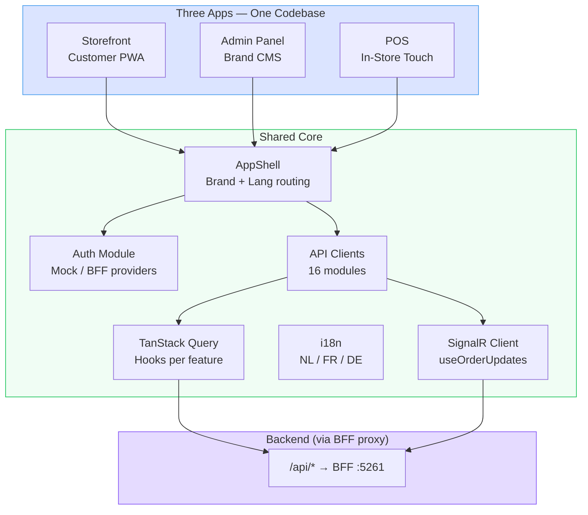

# Frontend — CLAUDE.md

## Architecture Diagrams

## Tech Stack

- React + TypeScript, Vite, pnpm
- TanStack Query for server state
- PWA (service worker, installable)

## Architecture

- Three apps from one codebase: customer storefront, in-store POS (touch-friendly), CMS admin panel
- App variant detected from hostname (`pos.`, `admin.`, or default storefront)
- URL structure: `/{brand}/{lang}/...` — brand and language resolved by AppShell
- Admin panel: `/{brand}/{lang}/admin/brands` for brand management
- Feature-based folder structure: `src/features/{storefront,pos,admin}/`
- Shared components in `src/components/` — AppShell, AppVariantLayout, ErrorBoundary, SuspenseWrapper
- API client modules in `src/api/` — axios with Vite proxy to BFF (`/api/*` and `/bff/*` → `http://localhost:5261`)
- Auth module in `src/auth/` — AuthContext, providers, route guards, session keepalive
- TanStack Query hooks per feature in `src/features/*/hooks/`
- SignalR client in `src/api/signalr.ts` with hooks: `useSignalR`, `useOrderUpdates`
- Strict TypeScript — no `any`
- i18n from day one: NL, FR, DE (react-i18next) — locale files in `src/i18n/locales/{nl,fr,de}/`

## Admin Panel Pages

Brand CRUD (list/create/edit), brand theming, shop CRUD (list/create/edit), shop opening hours, shop order lifecycle, product CRUD (list/create/edit), combo product CRUD, modifier group CRUD, menu category CRUD (list/create/edit), platform admin list, staff list, tax configuration, dashboard

## Type Definitions (`src/types/`)

- `auth.ts` — `AuthUser`, `AuthState` interfaces
- `common.ts` — shared domain types: `Brand`, `BrandSettings`, `BrandColors`, `BrandTypography`, `BrandTheme`, `ComboItemResponse`, `ConfigureOrderLifecycleRequest`, and all API request/response shapes

## Storefront

- Components: `LanguageSelector` (NL/FR/DE switcher with locale persistence), `ThemeProvider` (brand theming), `ShopStatusBadge`, `OrderStatusStepper` (lifecycle step indicator, brand-coloured, SignalR-driven)
- Pages: Home, MenuPage (`shops/:shopId/menu`), CheckoutPage (`checkout`), OrderConfirmationPage (`order/:orderId`), OrderTrackingPage (`order/:orderId/track`)
- Real-time pattern: `useOrderUpdates({ orderId, onStatusChange })` subscribes to SignalR `OrderStatusChanged` events — used on both confirmation and tracking pages
- `ordersApi.getById` extracts `.order` from `OrderTrackingResponse` internally to preserve its `Promise<OrderResponse>` contract; use `ordersApi.getTracking` when you need the full lifecycle too

## POS

- Pages: Dashboard (placeholder)

## Authentication

- **MockAuthProvider** (dev default, `VITE_MOCK_AUTH=true`): immediate mock user, role switcher toolbar (bottom-right corner)
- **BffAuthProvider** (real): fetches `/bff/user` via TanStack Query, listens for `auth:session-expired` events
- **AuthProviderSwitch** selects mock vs real based on `VITE_MOCK_AUTH` env var
- **RequireAuth** component guards routes: admin requires `brand-admin`/`platform-admin`, POS requires staff roles, storefront is public
- **useSessionKeepalive** hook pings `/bff/session/keepalive` every 15 min when user is active
- 401 from any API call dispatches `auth:session-expired` window event → auth state resets

## Environment Variables

- `VITE_MOCK_AUTH` — `true` for mock auth (default in dev), `false` for real BFF auth
- `VITE_MOCK_ROLE` — default role for mock auth (`platform-admin`, `brand-admin`, `counter-staff`, `customer`)
- `VITE_MOCK_DISPLAY_NAME` — display name for mock user

## Commands

- `pnpm dev` — start dev server
- `pnpm build` — type-check + production build
- `pnpm test` — run Vitest unit tests
- `pnpm test:e2e` — run Playwright E2E tests
- `pnpm lint` / `pnpm format` — ESLint + Prettier

## Key Constraints

- Offline mode required for in-store interface
- PWA is the mobile strategy (no native apps)

## Testing

- Vitest for unit tests, Playwright for E2E

For detailed patterns, see `.claude/docs/`.
